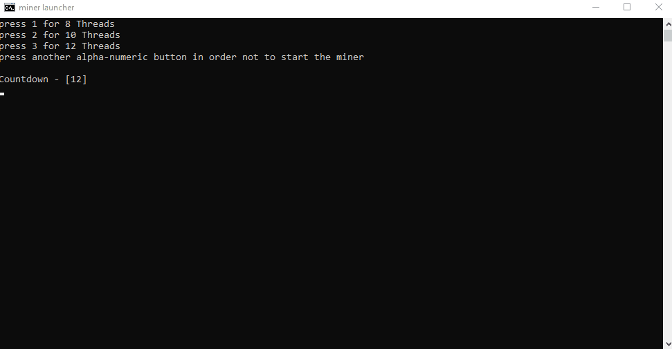

# vrsc-hellminer-launcher

A simple batch script that makes it easy to run the miner on a computer for everyday use.

Was created with the thought of running hellminer, but it is possible to run a different miner, for mine cryptocurrency
other than VRSC, or even run a GPU based miner after proper configuration.

Additionally - it was created for my personal needs, but I am making it available because it can also be useful to
someone.

## Sections:

1. [What is it for?](#what-is-it-for)
2. [How does it work? - presentation](#how-does-it-work---presentation)
3. [Configuration](#configuration)
4. [Running](#running)

## What is it for?

It is a batch script that can be added to the autostart folder to easily automate the launch of the miner along with the
system startup

- When the computer is started only to mine - after a set time, the miner will be started with the default option (e. g.
  on all processor threads)

- However, if you want to use your computer while mining, for a set amount of time you have the option to choose how
  many threads to start mining on - making your computer more responsive, able to use (it happens after pressing the
  appropriate button)

## How does it work? - presentation

10 threads launched after pressing '2' on the keyboard

12 threads launched when the  countdown was done

## Configuration

You need to edit the .bat file to assign your values to the appropriate variables.

1. Set the seconds after which the miner will run with the default settings:

       set /a countdown=20

2. Enter the folder location of the miner executable:

       set "location=C:\Users\User\Desktop\folder"

3. Paste your miner config (without the --cpu parameter). Example:

       set "config=hellminer.exe -c stratum+tcp://eu.luckpool.net:3956#xnsub -u RB7sFYVzfGSnFNcq255u7sCywvaiDRxcJh.worker -p x"

4. Set the number of threads you want to run when the specific button is pressed:

       set "if_1=8"
       set "if_2=10"
       set "if_3=12"

5. Set the number of threads to run when the countdown is over:

       set "threads=12"

<b>You can also add more miner startup options by adding them like the 3 I did.</b>

## Running

1. Manually - just start the .bat file.
2. If you want to launch it with every system startup - you need to add it to the autostart folder:

    The <b>Windows + R</b> will show you the "RUN" box where you can type <b>shell:startup</b> and the autostart
   folder will open. Here you can place the .bat file.
   

